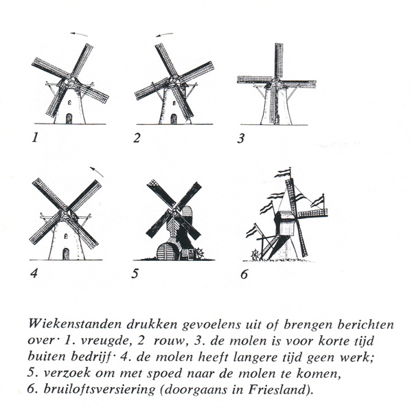

Hoi! Jos hier!

Ik ben blij om te kunnen zeggen dat we eindelijk wat consistente updates kunnen gaan geven! 🎉

De afgelopen maand was een gekke wervelwind van het vernieuwen van POLDERS z'n core gameplay loop, tot presentaties geven over onze voortgang, en een deep-dive in het rabbithole van webdevelopment. En weet je wat? Ik heb er enorm veel plezier in! Er is iets vreemd bevredigends aan het jongleren van compleet verschillende taken - het ene moment zit ik tot over mijn oren in game systems code, het volgende moment zit ik te klooien met CSS animaties (en vraag ik me af wat ik met mijn leven doe), en dan opeens sta ik voor mensen uit te leggen waarom Nederland onder water zetten in een videogame eigenlijk een goed idee is. Het is wild, het is gevarieerd, en het is precies het soort creatieve chaos waar ik van houd!

#### Nieuwe Video
We hebben een nieuwe video toegevoegd om wat pre-alpha gameplay te laten zien! Dani heeft hem gemaakt, en god zegene haar, hij is zoveel beter dan mijn vorige poging ^^'. [Je kunt hem hier bekijken](https://www.youtube.com/watch?v=AzYt_z4o8ro).

<iframe width="560" height="315" src="https://www.youtube.com/embed/AzYt_z4o8ro?si=uYyOWUr21lvrxKpb" title="YouTube video player" frameborder="0" allow="accelerometer; autoplay; clipboard-write; encrypted-media; gyroscope; picture-in-picture; web-share" referrerpolicy="strict-origin-when-cross-origin" allowfullscreen></iframe>

#### Website make-over!
We hebben een nieuwe website, waar je nu naar kijkt! We misten een duidelijk overzicht van het POLDERS project, en we wilden updates zoals deze gaan posten. Ik heb er waarschijnlijk te lang aan zitten knutselen, maar ik kon het niet laten om er wat style liefde aan te geven :) Kijk gerust even rond!

#### Presentaties
Het is blijkbaar ook het seizoen van presentaties! Vorige maand was het Everything Procedural, vorige week was het Rust Week.
Als je geïnteresseerd bent in wat technische details van POLDERS, [kun je de Rust Week presentatie hier vinden](https://www.youtube.com/live/84bX1nPDBr4?feature=shared&t=5627)

<iframe width="560" height="315" src="https://www.youtube.com/embed/90soMwEGZXw?si=rhztFeX1yO5lYEkb" title="YouTube video player" frameborder="0" allow="accelerometer; autoplay; clipboard-write; encrypted-media; gyroscope; picture-in-picture; web-share" referrerpolicy="strict-origin-when-cross-origin" allowfullscreen></iframe>

#### Wist je dat...
Je de stemming van Nederlandse windmolens kunt aflezen aan hun wieken?! Zie de afbeelding hieronder: De rustpositie van de wieken kan in een staat van vreugde (1), van rouw (2), van korte rust (3) of een lange rust (4) zijn. Een windmolen met beklede wieken gestopt in een X betekent een dringende bijeenkomst bij de windmolen (5), en blijkbaar houden de Friezen ervan om vlaggen rondom hun windmolens te hangen tijdens festiviteiten (6). Nu weet je wat die schattige windmolens op de dijk tegen je probeert te zeggen :)

 