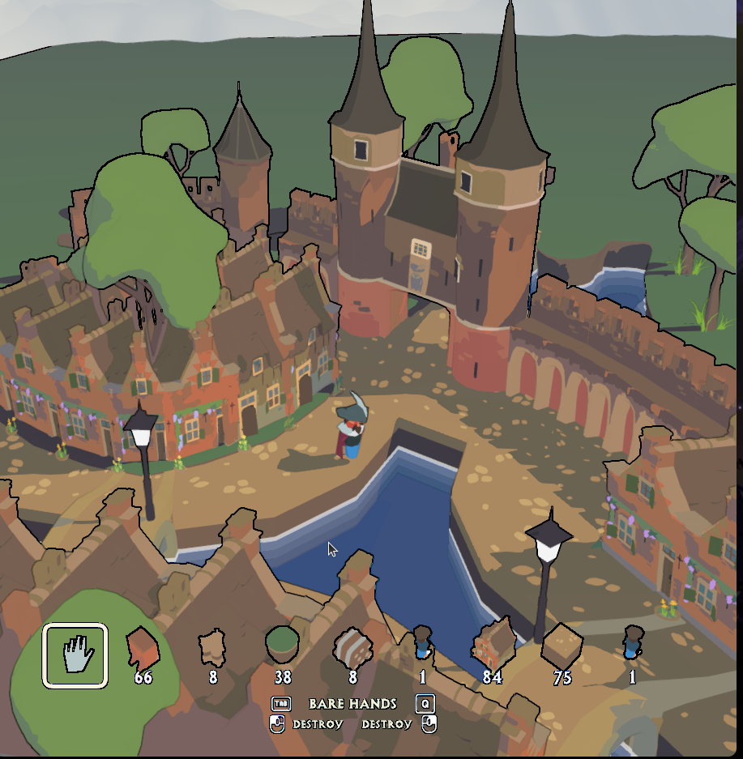
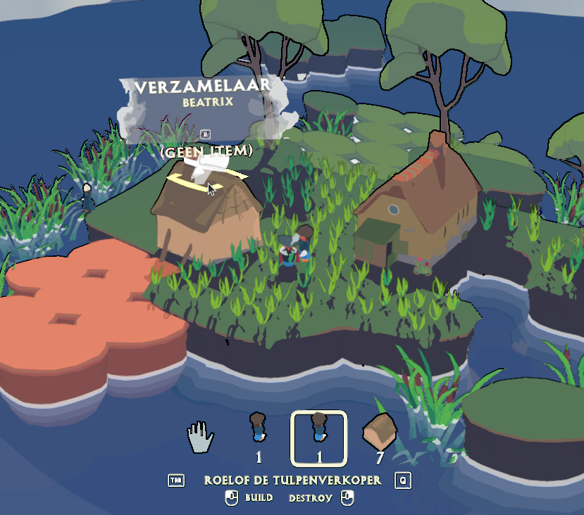
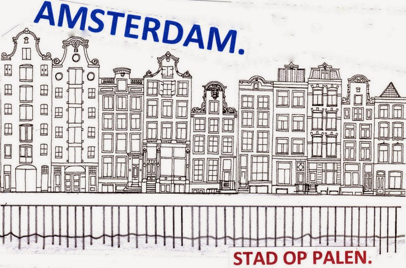

Hi Polderaars! 

Hier weer een nieuwe polderupdate! Het weer is lekker broeierig, maar dat weerhoudt ons niet van steady doorknokken aan dit heerlijke passieproject:

#### POLDERVLOG
Guys, we hebben eindelijk een persoonlijke vlog gemaakt! 🎬 Dit is echt waar het allemaal begon - onze pure liefde voor Nederland en onze gekke obsessie met molens en dijken. [Hier is de link](https://www.youtube.com/watch?v=kECn8C7ZWRk).

<iframe width="560" height="315" src="https://www.youtube.com/embed/kECn8C7ZWRk?si=37zRVDIgYM9wHiGr" title="YouTube video player" frameborder="0" allow="accelerometer; autoplay; clipboard-write; encrypted-media; gyroscope; picture-in-picture; web-share" referrerpolicy="strict-origin-when-cross-origin" allowfullscreen></iframe>

#### Villagers & Automatisering 
Het automatiseringssysteem begint eindelijk vorm te krijgen en man, wat is dit leuk om mee te spelen. 

Je villagers zijn geen saaie NPC's meer die maar wat rondlopen - nee, deze gasten hebben WERK te doen! Ze varen met trekschuiten heen en weer, draaien aan windmolens (die echt werken trouwens!), sjouwen met goederen, en houden je dijken in de gaten. Want ja, als je dijken het begeven...

#### Shading
Deze maand zijn we echt diep gegaan op de visuele kant van het spel. 

We willen dat POLDERS eruitziet alsof Van Ruisdael en Vermeer zelf de art director waren. Geen grapje! Die Nederlandse meesters hadden echt door hoe ons landschap eruitziet - die weidsheid, dat licht, die typische Nederlandse wolken. 

Dus we zitten nu tot diep in de nacht te klooien met grass shaders en vegetatie rendering. Het doel? Dat je echt het gevoel hebt dat je in een 17e-eeuws Nederlands landschap rondloopt. Met weilanden die er lekker groen uitzien, gras dat beweegt in de wind, en dat karakteristieke Nederlandse licht. 

#### Wist je dat...
veengrond echt niet chill is om op te bouwen? Toch staat zo'n beetje een kwart van Nederland op dit moerassige spul, inclusief Amsterdam!

Stel je voor: je wilt een huis bouwen, maar de grond is zo zacht als een spons vol water. Je huis zakt gewoon weg! Of wordt scheef. Of allebei. Dat is precies waarom onze voorouders zo creatief moesten worden. Houten palen de grond in rammen, en het waterpeil precies goed houden. En dat in de 17e eeuw!

Probeer maar eens een molen te bouwen op slechte grond - dan leer je snel waarom Nederland zo goed is geworden in "hoe bouw je iets dat niet omvalt". Het is niet voor niks dat wij wereldwijd de experts zijn in moeilijke bouwprojecten. We MOESTEN wel goed worden, anders waren we letterlijk weggezonken!

